# 🧬 Advanced RAG Architect

<div align="center">

[](https://huggingface.co/spaces/sridhar-1508/rag-architect)
[](https://www.python.org/downloads/)
[](https://opensource.org/licenses/MIT)

</div>

A high-precision **Retrieval-Augmented Generation (RAG)** system utilizing a hybrid pipeline of **Pinecone** (Vector Store), **Cohere** (Embeddings & Reranking), and **Google Gemini** (Generation) to deliver accurate, citation-backed answers from user-uploaded PDFs or raw text.

---

## 📊 System Architecture

```mermaid
graph LR
    A[User] -->|Query| B[Streamlit App]
    B -->|PDF| C[Splitter<br/>1000t/15%]
    C -->|Chunks| D[Embeddings<br/>mpnet-base]
    D -->|Vectors| E[Pinecone DB]
    E -->|Top 20| F[Cohere Rerank]
    F -->|Top 5| G[Gemini 2.0]
    G -->|Answer| A
    
    style B fill:#FF4B4B
    style E fill:#000000
    style F fill:#39594D
    style G fill:#4285F4
```



### Pipeline Flow:

1. **📄 Document Ingestion** → PDF/Text is split into chunks (1000 chars, 15% overlap)
2. **🔢 Embedding Generation** → Chunks are embedded using Cohere's `embed-english-v3.0` model
3. **💾 Vector Storage** → Embeddings stored in Pinecone serverless index
4. **🔍 Retrieval** → Top-20 semantically similar chunks retrieved
5. **🎯 Reranking** → Cohere reranks to Top-5 most relevant chunks
6. **✨ Generation** → Gemini 2.0 generates citation-backed answers

---

## 👤 Author

**Sridhar K**  
📧 Contact: [Email](mailto:sridhark1502@gmail.com)  
📄 Resume: [View Resume](https://drive.google.com/file/d/1ci1jmKH14PK7IzuIb5Ei48zBZPNT1b3W/view)

---

## 🏗️ Architecture Details

The system implements a **multi-stage retrieval pipeline** (Track B) designed to maximize context relevance and minimize hallucinations.

### 1. **Ingestion Layer**
- **Source:** PDF Documents or Raw Text
- **Chunking:** `RecursiveCharacterTextSplitter` (Size: 1000, Overlap: 150)
- **Embedding Model:** `cohere.embed-english-v3.0` (Dimension: 1024)
- **Storage:** Pinecone Serverless Index

### 2. **Retrieval Layer**
- **Vector Search:** Top-20 semantic search via Pinecone
- **Neural Reranking:** Top-5 reranking via `cohere.rerank-english-v3.0`
- **Logic:** Simple vector search captures broad context, while the reranker filters out irrelevant chunks that happen to share keywords, ensuring high precision

### 3. **Generation Layer**
- **LLM:** `gemini-2.0-flash` (Google DeepMind)
- **Prompting:** Strict instruction set requiring inline citations (e.g., `[1]`) based only on provided context

---

## ⚙️ Index Configuration (Track B)

**Vector Database:** Pinecone

- **Index Name:** `rag-app` (Configurable via .env)
- **Dimension:** 1024 (Matches Cohere v3 embeddings)
- **Metric:** `cosine` (Optimized for semantic similarity)
- **Pod Type:** Serverless (AWS/Starter)

---

## 🚀 Setup & Installation

### Requirements
- Python 3.10+
- API Keys: Pinecone, Cohere, Google Gemini

### 1. Clone & Install

```bash
git clone https://github.com/srihar-15/RAG-Architecture
cd RAG-Architecture
pip install -r requirements.txt
```

### 2. Environment Variables

Create a `.env` file in the root directory:

```env
PINECONE_API_KEY=your_pinecone_key
PINECONE_INDEX_NAME=rag-app
COHERE_API_KEY=your_cohere_key
GEMINI_API_KEY=your_gemini_key
```

### 3. Run Locally

```bash
streamlit run app.py
```

---

## 🎯 Features

- ✅ **PDF & Text Support** - Upload PDFs or paste raw text
- ✅ **Hybrid Retrieval** - Vector search + Neural reranking
- ✅ **Citation Tracking** - All answers include source references
- ✅ **Real-time Processing** - Streamlit interface with instant feedback
- ✅ **Scalable Architecture** - Serverless Pinecone index
- ✅ **Advanced Embeddings** - Cohere v3 embeddings (1024-dim)

---

## 📝 Technical Specifications

| Component | Technology | Purpose |
|-----------|-----------|----------|
| **Frontend** | Streamlit | User interface |
| **Vector DB** | Pinecone Serverless | Embedding storage |
| **Embeddings** | Cohere embed-v3.0 | Text → Vector (1024-dim) |
| **Reranker** | Cohere rerank-v3.0 | Precision filtering |
| **LLM** | Gemini 2.0 Flash | Answer generation |
| **Chunking** | LangChain | Document splitting |

---

## 📝 Remarks

### **Limits & Trade-offs**

1. **Latency vs. Precision:** Reranking adds ~200-500ms to the query time but drastically improves answer quality. We prioritized precision over raw speed.
2. **Statelessness:** The current implementation clears the vector index on every new ingestion. It is designed for single-session analysis rather than a persistent multi-user knowledge base.
3. **PDF Parsing:** Uses basic `pypdf`. Complex PDFs with tables or multi-column layouts may have degraded extraction quality compared to OCR-based solutions (e.g., Unstructured.io).
4. **Cohere Chunk Limit:** This system allows a maximum of 500 chunks per document to respect API rate limits and processing constraints.
5. **Single Concurrency:** The system is designed for a single active user. Since it performs a `delete_all` on the vector index for every new upload, simultaneous users would overwrite each other's data.
6. **Language Support:** The embedding model (`embed-english-v3.0`) and reranker are optimized specifically for English text. Performance on other languages may vary.

### **Future Improvements**

- 🔄 **Hybrid Search:** Implement sparse-dense vectors (Splade + Dense) to better catch keyword-specific queries
- 🖼️ **Multi-Modal support:** Upgrade Gemini integration to parse charts and images from PDFs
- 📊 **Evaluation Pipeline:** Integrate **Ragas** to automatically score generated answers for faithfulness and relevancy
- 💾 **Persistent Storage:** Add user sessions and multi-document knowledge bases
- 🌐 **API Deployment:** Create FastAPI endpoints for programmatic access

---

## 📄 License

This project is licensed under the MIT License - see the [LICENSE](LICENSE) file for details.

---

## 🤝 Contributing

Contributions are welcome! Please feel free to submit a Pull Request.

1. Fork the repository
2. Create your feature branch (`git checkout -b feature/AmazingFeature`)
3. Commit your changes (`git commit -m 'Add some AmazingFeature'`)
4. Push to the branch (`git push origin feature/AmazingFeature`)
5. Open a Pull Request

---

<div align="center">

**Made with ❤️ by Sridhar K**

[⭐ Star this repo](https://github.com/srihar-15/RAG-Architecture) if you find it helpful!

</div>
